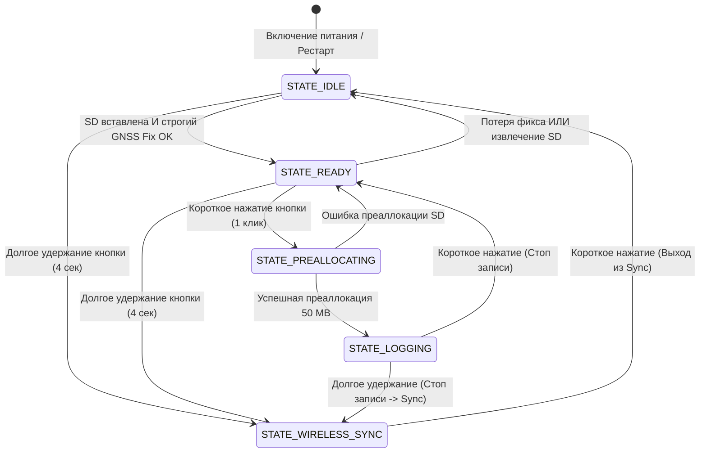

# 🗺️ Trackify System Architecture & Integration Guideline

Этот документ — единая точка входа («карта взаимодействия») для **мобильных разработчиков (Flutter/iOS/Android)**, **ИИ-агентов** и **разработчиков прошивки**. Здесь собраны все режимы работы, диаграммы состояний, сетевые протоколы, форматы данных и правила интеграции.

---

## 🧭 Навигация по документации проекта

| Документ | Для кого | Содержание |
|---|---|---|
| [**`README.md`**](README.md) | Все разработчики | Обзор проекта, распиновка, FreeRTOS задачи, сборка и прошивка |
| [**`SYSTEM_GUIDELINE.md`**](SYSTEM_GUIDELINE.md) *(текущий)* | Мобильные инженеры & AI | Полная карта состояний, протоколы BLE/WiFi, обработка ошибок, сценарии |
| [**`trackify_bin_format_spec.md`**](trackify_bin_format_spec.md) | Мобильные инженеры & Аналитики | Спецификация `.bin` (заголовок, 64B LogMeta, 38B TrackRecord, формулы UTC) |
| [**`bluetooth_integration_docs.md`**](bluetooth_integration_docs.md) | Flutter / BLE разработчики | Спецификация BLE-характеристик, UI-флоу в приложении Moto Lap Timer |
| [**`test/fixtures/README.md`**](test/fixtures/README.md) | QA & Разработчики парсеров | Тестовые синтетические фикстуры `v1_sample.bin` и `v2_sample.bin` |
| [**`ТЗ_корпус_3D.md`**](ТЗ_корпус_3D.md) | 3D-моделлеры / Инженеры | Габариты, требования к корпусу и компонентам |

---

## 🔄 Карта состояний трекера (State Machine)

Устройство работает под управлением конечного автомата состояний (**DeviceState**), который определяет поведение светодиода, дисплея и доступность записи/беспроводных функций.



### Сводная таблица режимов и индикации

| Режим (`DeviceState`) | Светодиод WS2812B | OLED экран | Доступные действия |
|---|---|---|---|
| **`STATE_IDLE`** | 🟠 Оранжевый (двойная вспышка) | `WAIT FIX` / `NO SD CARD` + спидометр 0.0 | Поиск спутников, проверка SD-карты, ожидание фикса |
| **`STATE_READY`** | ⚪ Белый (двойная вспышка) | `READY` + скорость + кол-во спутников | **1 клик:** Старт записи<br>**Удержание 4с:** Режим передачи |
| **`STATE_PREALLOCATING`** | 🔴 Красный (двойная вспышка) | `ALLOCATING...` | Подготовка файла 50 МБ (блокировка ~200-400 мс) |
| **`STATE_LOGGING`** | 🔴 Красный (горит постоянно) | `REC [HH:MM:SS]` + текущая скорость | Запись на 25 Гц<br>**1 клик:** Остановка записи |
| **`STATE_WIRELESS_SYNC`** | 🩵 Циан (двойная вспышка) | Экран "Wireless Sync": SSID, pass, BLE status | Передача логов по BLE и Wi-Fi<br>**1 клик:** Возврат в `IDLE` |

---

## 🛰️ Критерии готовности к записи (GNSS Fix Logic)

Логер переходит в режим готовности **`STATE_READY`** только при одновременном выполнении 5 условий:
1. **`fixType >= 2`** (наличие 2D или 3D фикса).
2. **`numSV >= 8`** (минимум 8 отслеживаемых спутников).
3. **`pvt.flags & 0x01` (`gnssFixOK`)** — официальный флаг u-blox достоверности навигационного решения.
4. **`(pvt.valid & 0x03) == 0x03` (`validDate` + `validTime`)** — подтверждённое время UTC (гарантирует корректную дату в заголовке файла).
5. **`pvt.hAcc < 10000`** — расчётная горизонтальная погрешность менее 10 метров.

---

## 📶 Два способа передачи данных

После заезда пользователь зажимает кнопку на 4 секунды. Трекер переходит в `STATE_WIRELESS_SYNC`, выключает приёмник GPS и **одновременно** запускает BLE-сервер и Wi-Fi точку доступа.

```
                  ┌──────────────────────────────┐
                  │    Trackify GNSS Tracker     │
                  │   (STATE_WIRELESS_SYNC)      │
                  └───────┬──────────────┬───────┘
                          │              │
             BLE GATT     │              │   Wi-Fi SoftAP
          (NimBLE Server) │              │  (192.168.0.11:80)
                          ▼              ▼
                  📱 Mobile App     💻 Any Browser / Phone
                 (Moto Lap Timer)   (Captive Portal SPA)
```

---

### Вариант 1: Bluetooth Low Energy (BLE) — Основной для мобильного приложения

* **Имя устройства:** `Trackify`
* **MTU:** Рекомендуется запросить `517` (для Android) или максимальный для iOS (~185).
* **Service UUID:** `4fafc201-1fb5-459e-8fcc-c5c9c331914b`
* **Command Characteristic:** `beb5483e-36e1-4688-b7f5-ea07361b26a8` (`WRITE` / `WRITE_NR`)
* **Data Characteristic:** `2c27702b-a010-4ea5-a228-4efb7965aa1b` (`NOTIFY`)

#### Диаграмма взаимодействия BLE (Sequence Diagram)

```mermaid
sequenceDiagram
    autonumber
    participant App as 📱 Mobile App (Flutter)
    participant Tracker as 🏍️ Trackify (ESP32)

    Note over App,Tracker: 1. Подключение и получение списка
    App->>Tracker: Connect & Request MTU (517)
    App->>Tracker: Enable Notifications on Data Characteristic
    App->>Tracker: Write Command: "LIST"
    loop Передача списка файлов
        Tracker-->>App: Notify: "<filename>;<filesize>\n"
    end
    Tracker-->>App: Notify: "END_LIST\n"

    Note over App,Tracker: 2. Скачивание выбранного лога
    App->>Tracker: Write Command: "GET log_001.bin"
    Tracker-->>App: Notify: "FILE:log_001.bin:285400\n" (Инициализация Progress Bar)
    loop Пакетная передача (Burst до 5 чанков)
        Tracker-->>App: Notify: [Raw Binary Chunks up to (MTU-3) bytes]
        Note over App: Накопление байтов в буфер, обновление %
    end
    Tracker-->>App: Notify: "END_FILE\n"
    Note over App: Парсинг .bin -> Отображение трека на карте

    opt Запрос реквизитов Wi-Fi
        App->>Tracker: Write Command: "WIFI"
        Tracker-->>App: Notify: "WIFI:Trackify:12345678\n"
    end
```

#### Обработка ошибок по BLE
* Если файл не найден: `ERROR: File not found: <filename>\nEND_FILE\n`
* Если ошибка файловой системы при `LIST`: `ERROR: Failed to open root\nEND_LIST\n`
* Если клиент отключился во время передачи: логер автоматически закрывает файл и сбрасывает состояние в `IDLE`.

---

### Вариант 2: Wi-Fi Точка доступа (HTTP Web UI) — Альтернативный

* **SSID:** `Trackify`
* **Пароль:** `12345678`
* **IP-адрес:** `192.168.0.11` (Static AP Gateway)
* **Captive Portal DNS:** Любой домен автоматически перенаправляется на `http://192.168.0.11/`.

#### HTTP Endpoints

| Метод | URL | Описание | Ответ |
|---|---|---|---|
| `GET` | `/` | Web-интерфейс (SPA) со списком треков, темой и анимацией | `200 text/html` |
| `GET` | `/download?file=log_001.bin` | Скачивание бинарного лога потоком | `200 application/octet-stream` |
| `POST` | `/delete?file=log_001.bin` | Удаление файла с карты SD | `200 text/plain (OK)` |

> 💡 **Конвертация в браузере:** Встроенный веб-интерфейс (`logs_ui.h`) умеет налету прямо в JS конвертировать как старые NMEA `.txt`, так и новые бинарные `.bin` в валидный формат **`.gpx`** с учётом метаданных `VER=2`.

---

## 📦 Формат данных `.bin` (Краткая шпаргалка)

Полная спецификация: [**`trackify_bin_format_spec.md`**](trackify_bin_format_spec.md).

```
┌────────────────────────────────────────────────────────────────────────┐
│ 1. Text Header Line (ASCII, заканчивается \n):                          │
│    #TRACKIFY:VER=2;FREQ=25;UTC=2026-04-18T13:47:02.000000000Z;PROTO=... │
├────────────────────────────────────────────────────────────────────────┤
│ 2. Service Metadata (LogMeta, ровно 64 байта, если VER >= 2):          │
│    - name[16], serial[16], model[16], hw_rev(1B), fw_ver(2B)           │
│    - mac[6], sample_rate_hz(2B), record_count(4B)                      │
├────────────────────────────────────────────────────────────────────────┤
│ 3. Track Records (по 38 байт каждая, little-endian):                    │
│    - iTOW (4B), nano (4B)                                              │
│    - lat (4B int32 / 1e7), lon (4B int32 / 1e7)                        │
│    - height (4B int32 / 1000.0 m), gSpeed (4B int32 / 1000.0 m/s)      │
│    - headMot (4B int32 / 1e5 deg)                                      │
│    - hAcc (4B uint32 / 1000.0 m), sAcc (4B uint32 / 1000.0 m/s)       │
│    - numSV (1B uint8), fixType (1B uint8)                              │
└────────────────────────────────────────────────────────────────────────┘
```

---

## 🛡️ Безопасность данных и Crash Recovery

1. **Защита от потери питания (Brownout / выдёргивание аккумулятора):**
   - Файл предвыделяется на 50 МБ блоками contiguous кластеров.
   - Каждые **5 секунд** и при штатной остановке прошивка обновляет поле `record_count` в блоке `LogMeta` и вызывает `logFile.sync()`.
   - При старте устройства функция `recoverInterruptedLogs()` находит все файлы с незавершённым размером и безопасно обрезает (`truncate`) их ровно по количеству записанных записей. Максимальная потеря при аварийном обесточивании — последние 5 секунд заезда.
2. **Буфер кольцевой очереди UART:**
   - Буфер увеличен до 8192 байт. При временной занятости шины SPI SD-картой поток 25 Гц гарантированно не теряет пакеты.
